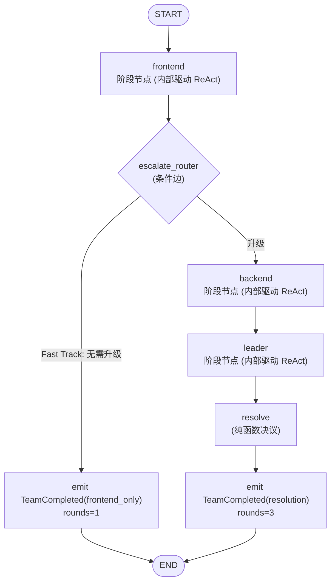

# Multi-Agent 编排 LangGraph 化方案

> 状态：**实施中** — Phase 0 ✅（2026-08-01），Phase 1 ✅（2026-08-01），Phase 2 ✅（2026-08-01），Phase 3 待评估
> 范围：`apps/server-py` 的 DIAGNOSIS 路由 Multi-Agent 编排
> 关联：`docs/design/python-core-upgrade-plan.md` 的 **G5**（多 Agent 编排）与 **T1**（DiagnosisMode 重构为 LangGraph Subgraph）
> 评审记录：本版已回应 CHANGES_REQUIRED 的 3 个阻断项（见 §3.2 实证与设计决策、§3.3 状态、§3.5 事件映射）

---

## 1. 结论（TL;DR）

**可行。** 当前 DIAGNOSIS 路由的 Multi-Agent 协同诊断（`DiagnosisMode`，`mode.py` ~920 行手写顺序编排）可以迁移到 LangGraph `StateGraph` 实现，前提已基本就绪：

- TASK 路由的 `AgentExecutor` 已完成 LangGraph ReAct 化（Phase A，`executor.py`）
- Checkpointing 已接入 `AsyncPostgresSaver`（G1，`checkpoint.py`）
- `langgraph 1.2.9` / `langchain-core 1.5.1` 已安装，`create_react_agent`、`StateGraph`、`interrupt` 均可用

**边界**：Python 后端使用 LangGraph 独立于 TS Server 侧的移除 LangGraph 决策（`python-core-upgrade-plan.md` 已声明）。本方案**不改动 TS `teams/` 模块**。

**核心设计决策（v2，基于 PoC 实证）**：不采用"把 ReAct 编译图 `add_node()` 注册为薄子图"的方案，而采用 **"胖阶段节点"** —— 每个阶段（frontend/backend/leader）是父图里的普通 async 节点，内部自行驱动 ReAct 图、把解析后的产物**显式 return 进父图状态**，token 经 `asyncio.Queue` 侧信道实时流出。原因见 §3.2。

---

## 2. 现状分析

### 2.1 当前 Multi-Agent 实现

```
DiagnosisRouteAgent (route_agent.py)          ← 外部契约（RouteAgent Protocol）
  └─ 超时/取消包裹 (180s) + TeamStreamEvent → Chat SSE 翻译
      └─ DiagnosisMode.execute (mode.py)      ← 手写 3 阶段顺序编排
          ├─ Phase 1: frontend_agent  → AgentExecutor(LangGraph ReAct) → JSON
          │            parse_frontend_output + check_rule_escalation(规则覆盖)
          │            └─ Fast Track: 无需升级 → TeamCompleted(frontend_only)
          ├─ Phase 2: backend_agent  → AgentExecutor(LangGraph ReAct) → JSON
          │            （只接收事实数据 context_for_backend，不含前端结论）
          ├─ Phase 3: leader         → AgentExecutor(LangGraph ReAct) → JSON
          │            四维度评分 → parse_scoring_output
          └─ resolve_diagnosis(纯函数) → needs_human / adopt_* / divergent
              → TeamCompleted
```

关键点：

- **外层是手写顺序代码**（`DiagnosisMode.execute`），内层每个阶段复用 `AgentExecutor`（已是 LangGraph StateGraph）。
- 共享上下文用 `Blackboard`（版本化 KV），每次诊断在内存中新建，**无持久化**。
- 事件契约：`TeamStarted → AgentStarted/AgentCompleted* → TeamCompleted`，由 `route_agent.py` 翻译为 Chat SSE。外部必须保持。

### 2.2 现有可复用资产

| 资产 | 位置 | 状态 |
|---|---|---|
| `ProviderChatModel`（LangChain 适配器） | `src/agent/langchain_adapter.py` | ✅ 可复用 |
| ReAct StateGraph 构建逻辑 | `executor.py` `_build_graph()` | ✅ 需抽成工厂复用（含 `registry`/`conversation_id` 显式参数化，见 §6 Phase 0） |
| `AsyncPostgresSaver` checkpoint | `src/agent/checkpoint.py` | ✅ 可复用（G1） |
| 纯函数：`parse_frontend/backend/scoring_output`、`check_rule_escalation`、`resolve_diagnosis` | `mode.py` | ✅ 原样保留 |
| `build_*_task`（中文 prompt 构造） | `mode.py` | ✅ 原样保留 |
| `Blackboard` | `blackboard.py` | ✅ 保留（加 JSON 序列化守卫，见 §3.3） |

### 2.3 当前痛点

1. **编排逻辑与执行逻辑混在同一文件**：约 250 行编排控制流与 ~400 行纯函数、~180 行 prompt builder 混在 920 行的 `mode.py` 里。加一个角色 = 手改顺序代码 + 补事件分支。
2. **诊断不可恢复**：任一阶段失败/进程崩溃，整场诊断重来。无 checkpoint。
3. **无人在回路（HITL）**：Leader 判定"信息不足"只能强制走 `needs_human`，无法在阶段边界暂停等用户补充。
4. **超时/取消是粗粒度外层包裹**：180s 包裹整场，无法做"每阶段超时 / 局部重试"。
5. **两条路由的执行心智模型不同**：TASK 直接跑 LangGraph，DIAGNOSIS 是手写循环包 LangGraph，维护者需同时理解两套驱动方式。

---

## 3. LangGraph 化设计

### 3.1 目标图结构



### 3.2 设计决策：拒绝"薄子图"，采用"胖阶段节点"（含 PoC 实证）

**被否方案**：把编译好的 ReAct 图直接 `add_node("frontend", react_graph)` 注册为薄子图。

**PoC 实证（langgraph 1.2.9，本仓库 venv 实测）**：

1. **子图状态对父图不可见**：父图 `DiagnosisState`（`task | frontend_output | ...`）与 ReAct 子图 `AgentState`（`messages | iteration_count`）schema 完全不重叠。实测 `add_node("frontend", child_graph)` 运行后，父图 `frontend_output` 始终为 `None`，`iteration_count` 也不回流。→ 父图拿不到阶段产物，`escalate_router` / `resolve_diagnosis` 无数据可用。
2. **嵌套事件歧义**：`astream_events` v2 流中父图 `LangGraph` 链与子图内部 `LangGraph` 链**同名**，子图内部 `agent` 节点事件混在同一流中。实测 tags 也不可干净区分（父图 `frontend` 与子图 `agent` 同为 `graph:step:1`）。→ 按 node name 映射会产生重复/遗漏的 `TeamStreamEvent`。

**采纳方案：胖阶段节点**：

- 每个阶段是父图 `DiagnosisState` 里的普通 async 节点，节点函数内部用 `build_react_graph` 工厂构建 ReAct 图并 `astream_events` 驱动之（与 `AgentExecutor.execute` 同一模式）。
- 节点把解析后的产物**显式 return** 进父图状态：`return {"frontend_output": asdict(parsed)}`。
- token 流经 `asyncio.Queue` 侧信道交给外层驱动实时转成 `StreamToken`（见 §3.5）。
- 因为 ReAct 图在节点函数内部被独立消费，**父图 `astream_events` 流上只有父图自身的节点边界事件，无嵌套歧义**。

该设计同时解决评审阻断项 #1（状态传递）与 #2（事件映射），且不改动现有 `AgentState` 与 `_build_graph` 结构。

### 3.3 状态定义（`src/agent/diagnosis/state.py`）

```python
class DiagnosisState(TypedDict):
    task: str
    conversation_id: str
    # 各阶段产物 —— 直接存 dataclass 实例
    frontend_output: FrontendOutput | None      # 含 need_escalation 等
    backend_output: BackendOutput | None
    scoring: ScoringResult | None
    resolution: DiagnosisResolution | None
    blackboard: dict | None                     # Blackboard.serialize()
```

要点：

- **产物 dataclass 天然 JSON 可序列化**：`FrontendOutput` / `BackendOutput` / `ScoringResult` / `DiagnosisResolution` 均由 `parse_*` 从 JSON 构建（字段全为 str/int/bool/list/dict），无需 `from_dict` 往返——LangGraph `JsonPlusSerializer` 可直接序列化 dataclass。节点消费旧产物时直接读 dataclass 字段（如 `state["frontend_output"].conclusion`）。
- **`Blackboard` 序列化守卫**：`blackboard.py:109-111` 的 `serialize()` 返回 `dict[str, object]`，类型层不保证 JSON 安全。v2 方案：
  1. 把 `write()` 的 `value` 类型收紧为 `JSONValue`（`str | int | float | bool | None | list | dict[str, "JSONValue"]`），在类型层防止非序列化数据进入。
  2. `serialize()` 增加 JSON 往返校验（`json.dumps` + `json.loads`），失败时降级为 `str(value)` 并记日志。
  3. 新增 `test_blackboard_serialize_roundtrip` 单测。

### 3.4 节点设计

| 节点 | 实现 | 说明 |
|---|---|---|
| `frontend` / `backend` / `leader` | 胖阶段节点：内部 `build_react_graph` + `astream_events`，产物显式 return | 工具过滤（`ToolRegistry.filter(role.tools)`）、`max_iterations` 复用；token 推入 `asyncio.Queue` |
| `escalate_router` | 条件边纯函数 | 保留 `check_rule_escalation` 规则覆盖；返回 `"backend"` 或 `"fast_track"` |
| `resolve` | 终端纯函数节点 | 原样调用 `resolve_diagnosis(frontend, backend, scoring)`，结果写 `state["resolution"]` |

**`ToolRegistry` 传递**：节点构建时经闭包捕获 `filtered_registry`。**明确假设：诊断执行期间工具注册中心不变**（当前诊断工具为静态内置工具，成立）。若未来支持运行时动态注册，需改为 `config["configurable"]` 传递，列为后续工作（不在本方案）。

**Fast Track 与事件**：Fast Track 分支不经过 `backend`/`leader`，由条件边直接跳到"收尾"节点——该节点仅发射 `TeamCompleted(frontend_only)` 并从图状态读取 `frontend_output`，保证事件契约完整。

### 3.5 事件翻译层（保持外部契约）

`DiagnosisMode` 保持 `async def execute(...) -> AsyncIterator[TeamStreamEvent]` **签名不变**。内部改为生产者/消费者模型：

```python
queue: asyncio.Queue["StreamTokenLike | None"] = asyncio.Queue()

async def run_graph():
    async for ev in graph.astream_events(initial_state, version="v2"):
        # 只处理父图节点边界：on_chain_start/end with tags ["graph:step:N"]
        # （内部 ReAct 的 on_chat_model_stream 已由节点内部消费，不在本流上）
        if is_node_start(ev):  yield AgentStarted(...)
        if is_node_end(ev):    yield AgentCompleted(...)
    queue.put_nowait(None)  # 结束信号

async def drain_tokens():
    while True:
        tok = await queue.get()
        if tok is None: break
        yield StreamToken(...)

# execute() 并发跑 run_graph 与 drain_tokens，按序转 TeamStreamEvent
```

要点：

- **token 实时性**：胖节点内部 `astream_events` 时把 `on_chat_model_stream` 的文本推入 `queue`，外层 `drain_tokens` 实时取出转 `StreamToken`。父图为顺序执行（frontend→backend→leader 串行），任意时刻至多一个阶段在跑，**队列无交错歧义**。
- **节点边界 → `AgentStarted`/`AgentCompleted`**：父图节点 `on_chain_start/end` 按 `name`（`frontend`/`backend`/`leader`）映射，图拓扑中不存在同名节点，无需 tags 过滤子图内部事件。
- 保留现有事件序列 `TeamStarted → (AgentStarted/AgentCompleted)* → TeamCompleted`；Fast Track 时只发射 1 组。

**不可变契约（关键约束）**：

- `DiagnosisMode.execute` 签名、`TeamStreamEvent` 事件序列不变
- `route_agent.py` 驱动逻辑、`_translate_team_event`、超时/取消逻辑**不修改**
- 中文 prompt（`build_*_task`、`AgentRole.system_prompt`）**不修改**
- 纯函数及其单测**原样保留**

### 3.6 取消与超时

- **取消**：外层驱动检测 `cancel_event.is_set()` 后 break 并关闭图运行（与现状行为一致）；节点内部驱动 ReAct 时也检查 `cancel_event` 及时中断（现状 `_run_agent` 已有此逻辑，平移）。
- **超时**：短期保留外层 180s 包裹；图化后下沉为"每阶段超时"（`asyncio.wait_for` 包节点调用），列为 Phase 3b。

---

## 4. 好处（Benefits，v2 已校准）

### 4.1 编排显式化：图拓扑表达流程

现状约 250 行编排控制流（Phase 1→升级检查→Phase 2→Phase 3→决议 + Fast Track 分支）混在 920 行文件里。迁移后编排拓扑由 `StateGraph` 的节点/条件边表达，读图即读流程；纯函数与 prompt builder 独立存放。**幅度诚实说明**：控制流本身不复杂，收益是"编排与逻辑解耦 + 图可视化"，不是"920 行→几十行"。

### 4.2 阶段节点复用 ReAct 工厂

三个阶段节点共享 `build_react_graph` 工厂，与 TASK 路由同一执行基座。相比现状"每个阶段 new 一个 `AgentExecutor`"，复用点从"对象实例"提升为"图工厂"，DIAGNOSIS 与 TASK 的执行路径同构。

### 4.3 团队级 Checkpointing（Phase 2 交付）

父图挂载同一 `AsyncPostgresSaver`（`thread_id = team_run_id`），诊断中间态（各阶段产物）可持久化：

- 前端排查完崩溃 → 恢复后从后端阶段继续，不重复花前端阶段的 LLM 成本
- 诊断中间态可审计（checkpoint = 阶段快照）

**为何 v2 把它提前到 Phase 2**：胖节点设计下父图是唯一被 checkpoint 的图，内部 ReAct 运行是瞬态工作（崩溃后重跑一次即可），规避了"子图嵌套 checkpoint"这一 langgraph 高风险区（评审建议验证的 PoC 见 §7）。

### 4.4 Human-in-the-Loop（Phase 3c）

`interrupt()` 在阶段边界暂停（如 Leader 判定信息不足 → 暂停等用户补充字段，替代强制 `needs_human`）。需要前端配合，故排到 Phase 3。

### 4.5 统一底层执行基座

TASK 与 DIAGNOSIS 都经 LangGraph + `astream_events` 驱动，LLM 调用路径（`ProviderChatModel`）、可观测性埋点（Langfuse Generation）、取消语义共用一套。**诚实说明**：上层事件类型仍各自独立（`StreamToken` vs `DiagnosisPhase`），统一的是传输与执行机制，不是事件语义。

### 4.6 规则与逻辑保持纯函数、可单测

LangGraph 节点是普通 async 函数。`check_rule_escalation`、`resolve_diagnosis`、`parse_*`、`build_fallback_scoring` 这些**已有单测的纯函数原样保留**，图只负责连接。边界校验（JSON 解析降级、评分兜底）不因迁移丢失。

### 4.7 为 G5（Supervisor / 动态委派）铺路

编排声明化后，新增角色 = 加一个阶段节点 + 一条边；角色间动态委派（Supervisor 模式）有标准范式承接，而非继续堆顺序代码。

---

## 5. 代价与风险（Costs & Risks）

| 风险 | 影响 | 缓解 |
|---|---|---|
| `langgraph` 1.x API 与 0.4 差异（1.2.9） | 示例代码多为 0.4，易踩坑 | 固定 `langgraph>=1.0,<2.0`；以本地环境实测为准 |
| 角色间 JSON 文本交接脆弱 | 迁移不改变"字符串 JSON 握手"，解析失败走降级 | **短期**：保留 `parse_*` + fallback；**可选（Phase 3d）**：`with_structured_output` 每节点结构化输出，需重设计 prompt/输出契约 |
| 事件时序保真 | 生产者/消费者模型可能改变 `TeamStreamEvent` 发射时机 | 图级测试断言完整事件序列（§7）；父图串行 + 单队列消除交错 |
| 团队级 checkpoint 的序列化 | AsyncPostgresSaver 需 JSON 可序列化 state | 产物 dataclass 天然可序列化；Blackboard 加 JSON 守卫（§3.3） |
| `asyncio.Queue` 侧信道的并发细节 | token 丢失或乱序 | 父图串行执行保证任意时刻单生产者；队列结束信号 + 异常透传 |
| 诊断质量本身不提升 | 编排重构 ≠ 诊断变准 | 明确边界：T4（真实监控工具）、P1（会话持久化）为独立工作项 |
| 图级测试覆盖不足 | 回归风险 | 新增图级测试（§7） |

---

## 6. 迁移路径（Hybrid，分阶段）

> 遵循项目记忆：**先完成规划，再进入 Implementation**；每阶段向后兼容。

### ✅ Phase 0 — 抽取 ReAct 工厂（无行为变化）

- 从 `executor.py::_build_graph` 抽出工厂，**完整签名必须显式传参**（现状经闭包隐式捕获 `self._registry` 与 `conversation_id`）：

  ```python
  def build_react_graph(
      model: ProviderChatModel,
      tool_defs: list[dict],
      system_prompt: str,
      registry: ToolRegistry,
      conversation_id: str,
      checkpointer=None,
      max_iterations: int = 5,
  ) -> StateGraph: ...
  ```

- `AgentExecutor` 改为调用该工厂，行为不变。
- **验收**：现有 `tests/test_agent.py` 全绿；TASK 行为不变。

### ✅ Phase 1 — 新增 LangGraph 版 DiagnosisMode（Feature Flag 默认关）

> 实施说明（2026-08-01）：
> - **事件侧信道精化**：§3.5 的"外层 astream_events 节点边界映射 + 独立 token 队列"收敛为**单 `asyncio.Queue` + 父图 `ainvoke`**。阶段节点把 AgentStarted/AgentCompleted/AgentError 推入同一 FIFO，外层按序转发；TeamCompleted 由 `ainvoke` 返回的最终状态派生。PoC 实证（`apps/server-py` venv）确认外层 `ainvoke` + 节点内驱动内层 ReAct 图（`astream_events`）可行且模型流事件被内层正确捕获，事件序列与手写版一致。
> - **token 不进侧信道**：当前契约 `TeamStreamEvent` 无逐 token 变体，token 由 `_run_phase_agent`（复用 `AgentExecutor`）内部收集为该 Agent 的 `output`，与手写版 `_run_agent` 相同 —— 避免向 `TeamStreamEvent` 流混入 `StreamToken`。
> - **顺带修复潜在 bug**：langchain_core 1.5.1 下 `AIMessage(tool_calls=None)` 触发 pydantic ValidationError（`react_graph.call_model` 与 `langchain_adapter._agenerate` 两处，`176769b` 引入、Phase 0 原样搬入）。已改为空 list，并新增 `tests/agent/test_react_graph.py` 回归测试。此 bug 影响 TASK 路由纯文本回复，属既有潜伏问题。

文件变更：

| 操作 | 文件 | 说明 |
|---|---|---|
| CREATE | `src/agent/diagnosis/state.py` | `DiagnosisState`（§3.3） |
| CREATE | `src/agent/diagnosis/graph.py` | 胖阶段节点、`escalate_router`、`resolve`、图组装、`asyncio.Queue` 侧信道 |
| MODIFY | `src/agent/diagnosis/mode.py` | `DiagnosisMode.execute` 按 flag 分流：旧顺序路径 / 新图路径；纯函数不动 |
| MODIFY | `src/agent/diagnosis/blackboard.py` | `write()` value 收紧为 `JSONValue` + `serialize()` JSON 往返守卫 |
| MODIFY | `src/config.py` | 添加 `langgraph_diagnosis_enabled: bool = Field(default=False)` |
| CREATE | `tests/agent/diagnosis/test_diagnosis_graph.py` | 图级测试（§7） |

- **验收**：双路径下 `TeamStreamEvent` 序列一致；新旧各跑一组端到端（`test_agent.py` + 手 curl）。

### ✅ Phase 2 — 默认开启 + 团队级 Checkpointing

> 实施说明（2026-08-01）：
> - **Windows 事件循环（关键前提）**：psycopg（AsyncPostgresSaver 后端）不能在 ProactorEventLoop 上运行；uvicorn 0.36+ 的 `asyncio_loop_factory` 在 win32 硬编码 ProactorEventLoop（无视事件循环 policy）。`main.py` 切 `WindowsSelectorEventLoopPolicy` + `loop="none"`，推荐 `python -m src.main` 启动（`python -m uvicorn src.main:app` 会先建 loop 再导入 app，policy 来不及生效）。
> - **隔离策略**：新增 `langgraph_diagnosis_checkpoint_enabled`（默认 True）专控父图团队级 checkpoint，与 G1 `langgraph_checkpoint_enabled` 隔离 —— G1 保持默认关，避免 TASK 路由的 ReAct 也挂 checkpointer（thread=conversation_id，多轮消息会累积/串扰）。内层阶段 `_run_phase_agent` 显式 `checkpoint=False`（即便未来激活 G1 也保持瞬态）。
> - **断点恢复实证（§7 `test_nested_checkpoint` 实验 PASS）**：阶段崩溃（runner 抛 BaseException，`_emit_agent_run` 的 `except Exception` 不捕获）后，同 thread `ainvoke(None)` 续跑 —— `get_state.next` 定位待续节点，frontend **不重跑**、崩溃前产物（`frontend_output`）从 checkpoint 保留，backend→leader→resolve 续至完成，`TeamCompleted` 可派生。**注意**：续跑不能重传全量 initial_state（会重置状态、从 START 重跑）。
> - **已知限制**：续跑时 Blackboard 闭包是新建的空实例，`_build_*_task` 的 `bb.to_context_string()` 上下文丢失（`context_for_backend` 存于 state 保留，不影响核心事实数据）。如需完整保真，节点需从 `state["blackboard"]` 恢复 bb（后续增强）。
> - **降级**：DB/loop 不可用时 checkpointer 创建失败 → 日志告警 + 降级为无状态执行（等价 Phase 1），不阻断诊断。

文件变更：

| 操作 | 文件 | 说明 |
|---|---|---|
| MODIFY | `src/config.py` | `langgraph_diagnosis_enabled` 默认 True；新增 `langgraph_diagnosis_checkpoint_enabled`（默认 True） |
| MODIFY | `src/agent/checkpoint.py` | `get_checkpointer(required=...)`：团队级 checkpoint 可跳过 G1 门控；pool 加 `autocommit=True`（`CREATE INDEX CONCURRENTLY` 不能在事务块内执行） |
| MODIFY | `src/agent/diagnosis/graph.py` | `build_diagnosis_graph(checkpointer=...)`；`run_langgraph_diagnosis` 挂 saver（thread_id=team_run_id）+ 降级兜底；`_run_phase_agent` 显式 `checkpoint=False` |
| MODIFY | `src/agent/executor.py` | `AgentExecutor(checkpoint=...)` 参数（内层瞬态） |
| MODIFY | `src/agent/diagnosis/mode.py` | **删除旧顺序编排主体 + `_run_agent` + `AgentRunResult`**；`execute()` 恒委托图路径 |
| MODIFY | `src/main.py` | Windows 事件循环切 SelectorEventLoop（psycopg 前提）+ `loop="none"` |
| CREATE | `tests/agent/diagnosis/test_checkpoint_resume.py` | `test_nested_checkpoint` 实验（DB 可用则跑，否则 skip） |
| MODIFY | `tests/agent/diagnosis/test_diagnosis_graph.py` | 图单测关闭团队级 checkpoint；flag 分流测试收敛为恒走图路径 |

- flag 默认 `True`；图顶层挂 `AsyncPostgresSaver`（`thread_id = team_run_id`），断点恢复经 §7 实验实证（见上）。
- 灰度验证（curl DIAGNOSIS 端到端，0 Proactor 错误 + checkpoint 落库）通过后**删除旧顺序编排主体**（保留全部纯函数与 prompt builder）。
- 同步更新 `python-core-upgrade-plan.md`：T1 标记完成、G5 拆分为"基础版已完成 / Supervisor 动态委派待评估"。
- **验收**：DIAGNOSIS 回归通过（全量 145 passed，2 个既有失败不变：stale `test_config` + DB 依赖 `search_knowledge`）；`mode.py` 编排主体移除。

### ⬜ Phase 3 — 独立增强（各有触发条件，不阻塞）

| 项 | 内容 | 触发条件 |
|---|---|---|
| 3a | 每阶段超时下沉 + 局部重试 | 外层 180s 不足以区分单阶段耗时瓶颈时 |
| 3b | HITL（`interrupt` 阶段边界暂停） | 产品确认"信息不足时暂停等补充"交互，前端配合 |
| 3c | 每节点结构化输出（`with_structured_output`） | 角色间 JSON 交接解析失败率偏高时；需重设计 prompt/输出契约 |

（Checkpointing 已并入 Phase 2。）

---

## 7. 测试与验证

**保留（不因迁移删除）**：

- `tests/agent/diagnosis/test_mode.py`：`extract_json`、`check_rule_escalation`、`parse_*`、`build_fallback_scoring`、`resolve_diagnosis`
- `tests/agent/diagnosis/test_blackboard.py`：Blackboard 全部单测（新增 roundtrip 用例）
- `tests/agent/test_agent.py`：TASK 路由回归

**新增**：

| 测试 | 内容 |
|---|---|
| `test_compile` | 图可编译、节点/边存在 |
| `test_fast_track` | 只跑 frontend 阶段 → `TeamCompleted(frontend_only)` |
| `test_escalation_path` | frontend → backend → leader → resolve 全链路 |
| `test_rule_override` | LLM 漏判但 `check_rule_escalation` 命中 → 强制升级 |
| `test_event_sequence` | 断言完整 `TeamStreamEvent` 序列与现状一致（含 token 顺序） |
| `test_resolution_branches` | `needs_human` / `adopt_*` / `divergent` 各分支 |
| `test_cancel` | `cancel_event.set()` 中途中断 |
| `test_blackboard_serialize_roundtrip` | Blackboard JSON 往返 + 非序列化值降级 |
| ✅ `test_nested_checkpoint`（实验，已实现为 `test_checkpoint_resume.py`，DB 可用则跑否则 skip） | 父图挂 checkpointer 时 checkpoint blob 内容与恢复行为。Phase 2 实证：中间态快照保留 + 崩溃后续跑（`ainvoke(None)`）不重跑 frontend |

**端到端验收**：

```bash
pnpm --filter @agentforge/server-py test        # 全量
# 手 curl: 诊断请求 → SSE 事件序列与迁移前一致
```

---

## 8. 关联文档

- `docs/design/python-core-upgrade-plan.md` — G5（多 Agent 编排，P3）、T1（DiagnosisMode → LangGraph，P2）
- `docs/architecture/routing.md` — 路由架构（原 `overview.md` 已删除，引用已迁移至此）
- `docs/agent-runtime.md` — Agent Runtime 说明

---

## 9. 明确不做（Scope Exclusions）

- 不改 TS `teams/` 模块（TS 侧移除 LangGraph 决策的约束）
- 不引入 `create_react_agent` 作为默认执行器（需 LangChain Tool 包装，改动大、收益小；继续复用 `ToolRegistry` + 自建 ReAct 图）
- 不把 ReAct 编译图作为"薄子图"注册（PoC 证明状态不可回流 + 嵌套事件歧义，见 §3.2）
- 不解决诊断质量问题（T4 mock 工具、P1 会话持久化为独立工作项）
- 不改变中文 prompt 与外部 SSE 契约
